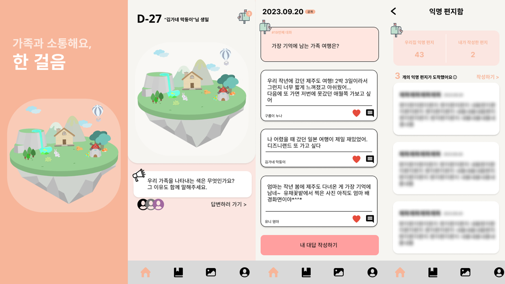
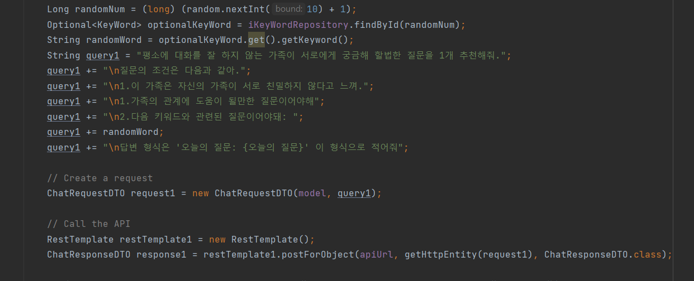

# **한 걸음**

 

#### 매일 주어지는 공통 질문을 통해, 가족간의 대화를 유도하는 AI기반 소통 서비스

### Front
  
 

### Back / DevOps 
 

 

 

### AI
 

### Communication / SCM

 

## 목차
- [ 개요 ](#개요)
- [ 기능소개 ](#기능소개)
- [ 질문 생성 과정 ](#질문생성과정)
- - -
## 개요
- 2023 인천대학교 정보기술대학 콘테SW트
- 팀명 : 한 걸음

- - -

## 기능소개

- 매일 가족 구성원에게 주어지는 **공통 질문**
    - **챗GPT**가 가족의 특성과 대화 키워드를 조합하여 매일 질문을 만들어냅니다.
    - 매일 오전 6시, 가족 구성원 모두에게 같은 질문이 주어집니다.
    - 본인 포함 모두가 답하면 다른 구성원의 답변을 확인할 수 있습니다.
- 익명으로 마음을 전할 수 있는 **익명 쪽지**
    - 익명으로 전해지는 건의함입니다.
    - 매주 금요일 오전 6시, 일주일간 쌓였던 쪽지가 공개됩니다. 주말동안 가족과 함께 익명 쪽지를 읽으며, 이야기를 나눠보세요.
- 서프라이즈! 매일 한 명, 퀴즈를 낼 수 있는 **깜짝 퀴즈**
- 우리 가족의 사진을 올리고, 추억을 저장할 수 있는 **사진첩**
- 가족 일정 등록을 통해, 기념일을 쉽게 기억할 수 있는 **디데이**
- 차곡차곡 쌓이는 질문 내역으로,  우리 가족만의 **섬**이 점점 성장해요

- - -

### 질문 생성 과정

- **가족 그룹에 따른 질문**
1. 가족 생성 시 받은 **가족 관계**(화목 / 보통 / 나쁨)를 바탕으로 가족 정보 생성
2. 가족 간의 대화를 위한 주요 **대화 키워드** (ex, 여행, 추억, 목표, 행복) 중, 랜덤으로 하나 선택
3. 매일 가족 관계와 대화 키워드를 바탕으로 질문 생성
- **모든 가족 공통 질문**
1. 가족 관련 질문이 아닌, 본인에 관련된 질문 생성

→ 가족 관련 질문과 본인 소개 질문을 반복하며, 가족과 대화할 기회 제공

### Prompt Engineering

- 가족 관계에 따라 query문을 다르게 작성.
- 가족 관계 + 랜덤으로 정해진 그날의 대화 키워드를 기반으로 질문 생성
- DB 저장을 위한 답변 형식 지정
  
- - -

## **Members**
<table>
<tr align="center">
    <th>문혜영</th>
    <th>전민영</th>
      <th>최수환</th>
    <th>권효택</th>
</tr>
<tr align ="center">
    <td></td>
  <td></td>
     <td> </td>
  <td> </td>
</tr>
<tr align ="center">
    <td>Back</td>
    <td>Back</td>
    <td>Front</td>
    <td>Front</td>
</tr>
</table>

